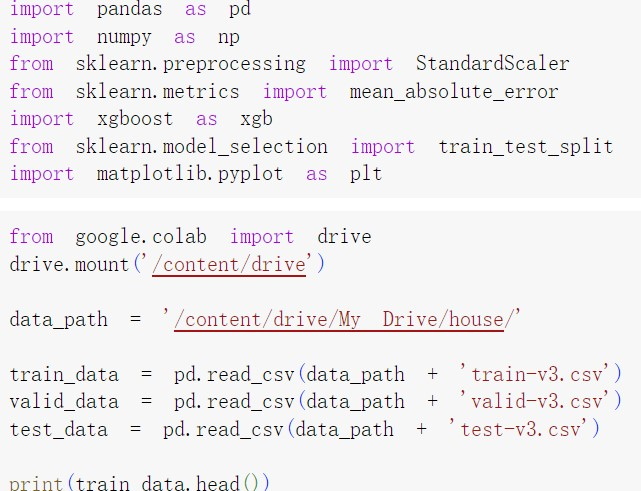
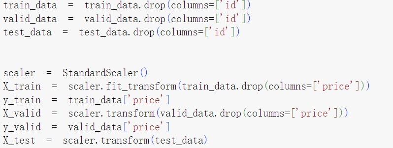
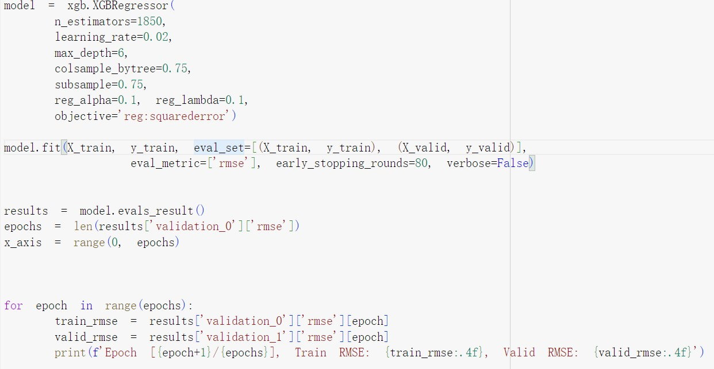
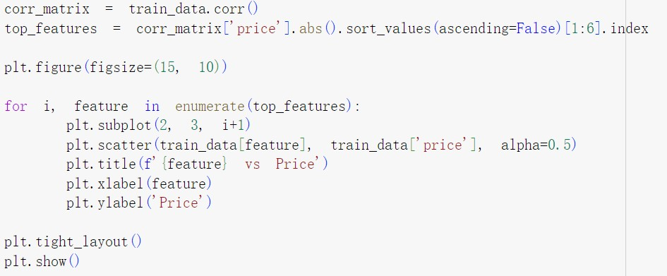
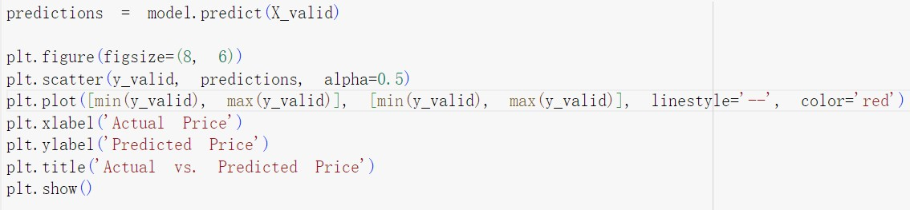
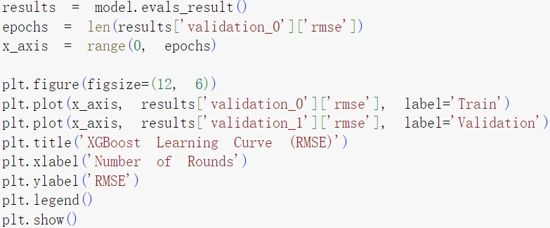
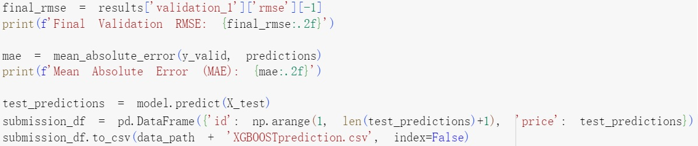
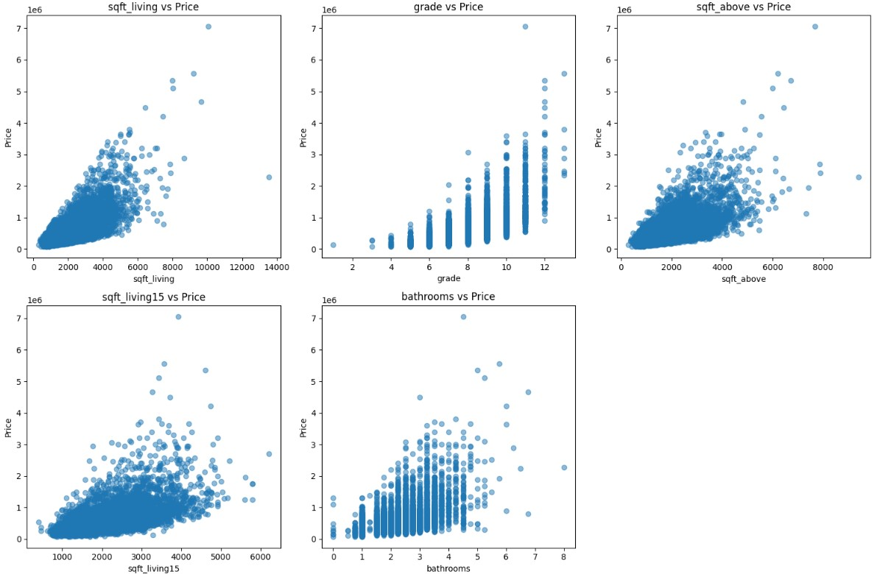
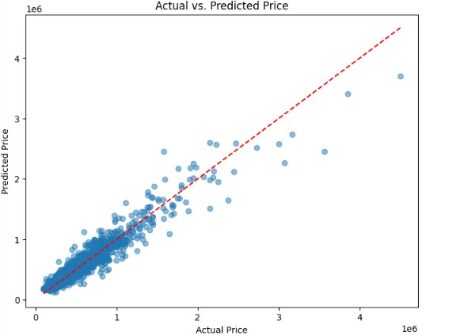
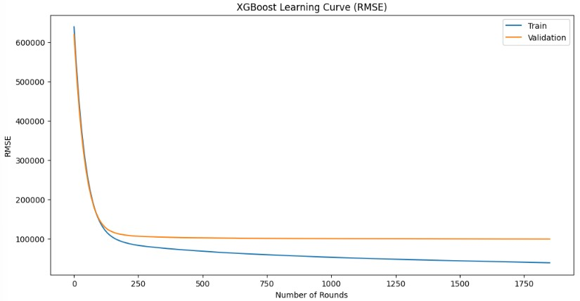

# NYCU_Machine Learning 2023-Regression 
### 312605015詹恆瑜
## Author
|Student ID|GitHub Account|Name|Email| 
| :--:    | :--:   |:--:  | :--: |
|312605015|312605015|詹恆瑜|happydog101155@gmail.com| 

---

-data

1. test-v3
2. train-v3
3. valid-v3
4. metadata
5. sampleSubmission

-image

1. import.jpg
2. predeal.jpg
3. train.jpg
4. relation.jpg
5. scatter.jpg
6. learn.jpg
7. finalrme.jpg
8. relation_img.jpg
9. scatter_img.jpg
10. learn_img.jpg

-XGBOOST.ipynb

-XGBOOSTprediction

-README.md
## 1.作法說明
我使用XGBoost演算法和MLP來作這次的回歸模型，一開始我使用三層MLP作時，試了好幾次MAE大概落在70000就掉部下去了，於是我後來使用XGBOOST的架構重新實作這次的房價預測模型，我使用的資料庫有xgboost、pandas、numpy、skleaen、matplotlib.pyplot，將房價估測的dataset，包括訓練集與測試集都放在goodle drive裡的house中，接著再使用colab做操作。
首先第一步，將dataset輸入後，再做資料的前處理，接著定義模型並開始訓練，結果呈現出每epoch的train和vaildation的RMSE，第二步再作特徵分析，呈現各參數與房價之間的關係，與畫出實際和預測價格的XY散點圖關係得知自己的預測結果準確度，第三步並呈現出驗證模型的RMAE和MAE，與畫出學習曲線知道自己的訓練狀況來作模型評估，最後一步再把預測的結果輸出csv檔來，檔名為XGBOOSTpredictions。

## 2.程式方塊圖與寫法

首先導入要使用的函式庫並連結我的雲端，且確保讀到檔案就把資料開頭資料呈現出來，並確認資料無誤。

接著將讀入的資料預處理，把資料的非必要訓練文字給去除，並使用StandardScalar對特徵進行標準化。

接著建立XGBoost模型，參數調整包括n_estimators、maxdepth、learning rate、colsample_bytree、subsample、reg_alpha、reg_lambda，前兩者調整太高會讓模型越高機率過擬和，後四者參數值主要功能為減少過擬合的發生，定義好後開始訓練並呈現每一次epoch的訓練狀況。

訓練完畢後作結果分析，包括房價與特徵參數的相關性圖、實際房價與預測房價的xy散點圖和學習曲線圖來知道學習的結果如何。

最後呈現訓練的RMSE和MAE結果並疆域預測的結果給存下來。

## 3.畫圖做結果分析

從這張圖可以看到房價與個房子參數的相關性圖，可以知道特徵依序為sqft_living、grade、sqft_above、spft_living15、batchrooms跟房價最為相關。

從這張散點圖可以知道自己模型預測的房價與validation驗證的房價的準確度，可以看到房價越高的樣本數較少，所以可能是因為這樣房價越高的預測數據都跟實際差比較大，反之，大多數據都在低價位的，低價位的數據就預測較為跟真實相近。

從我畫出的learning Curve中，可以看到Train loss在一開始下降得很快，因為我的learning_rate、n_estimators、max_depth調整較大就會很快就趨於平坦，在epoch不斷參加的情況下train的RMSE有不斷再下降，但是Validation的RMSE就下降得很慢，甚至趨於了一個值。

## 4.討論預測值誤差很大的，是怎麼回事?
我認為第一點可能的原因是數據不夠多，若可以增加數據讓模型訓練更完善，可能可以改善這個問題，第二點我認為是訓練的模型太簡單，使得無法呈現真實的情況，最後可能是因為模型的參數調整不好，我不斷地調整模型的參數，結果validation的結果都沒有顯著的下降，甚至到後面不斷出現過擬合的狀況，使得我的train的RMSE值有不斷下降，但是Validation的RMSE值都無法在往下。

## 5.如何改進?
從我的實驗結果，我認為我可以再重新調整我的XGBoost的參數值，透過增加決策樹的數量和最大深度的同時，也調整每棵樹使用的特徵比例和正則化參數來達到讓模型訓練得更好又不至於到過擬合，並再訓練模型時調整好early_stopoing的值，讓模型再沒有顯著提升時就停止訓練，不會一直陷入過擬合。
我會試著使用其他的模型是看看效果如何，就像我從最一開始使用MLP到現在使用XGBoost來作，可以知道各個模型的特性和結構，透過了解更多模型的特色或是多個模型的集成方法來降低預測的誤差值。s